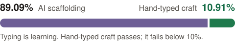

<div align="center">
  <a href="https://tlindow.github.io/">
    
  </a>
  <h1>Lindow Labs</h1>
  <p><strong>Tyler Lindow (@tlindow)</strong> · Engineering Management</p>

  <p>
    <a href="https://tlindow.github.io/"></a>
    <a href="https://www.linkedin.com/in/tlindow/"></a>
    <a href="./exercises/README.md"></a>
    <a href="https://tlindow.github.io/"></a>
    
  </p>
</div>

<div align="center">
  
</div>

---

### 👤 Identity & Context

- **Role:** Engineering Management
- **Status:** Active · Open to Engineering Leadership & Architecture
- **Location:** San Diego, CA 📍 &rarr; Seattle, WA 🌲
- **Pronouns:** he/him/tyler
- **Supports:** 🏳️‍🌈 LGBTQ+ · 👩 Women in Tech · ✊🏾 BIPOC · ♿ Differently Abled

---

### 🎯 Deepen

**Engineering management craft, and the labs that practice it.**  
Start at the [marketing site](https://tlindow.github.io/). This profile is the next step: how that craft is led, and personal system-design labs to type through.

- **Marketing site:** [tlindow.github.io](https://tlindow.github.io/)
- **Network:** [linkedin.com/in/tlindow](https://www.linkedin.com/in/tlindow/)
- **Labs:** [`exercises/README.md`](./exercises/README.md)

---

### 🧠 Core Architectural Philosophy

1. **System Architecture as Sculpting**  
   Top-down AI generation; human craftsmanship meticulously chips away excess logic to construct sustainable, resilient distributed architectures.

2. **Domain-Driven Reliability**  
   Architectural choices must anchor to core business value. Mediated platform re-architecture at Affirm to enforce strict domain separation: groundwork toward a 99.99% availability target.

3. **First-Principles GenAI Upskilling**  
   "Learning-by-doing" pedagogy to debunk misconceptions and systematically de-risk catastrophic production failure modes.

4. **The Embodiment Axiom**  
   > *"As software engineers, typing IS learning. When we type, we embody the code, the software. If we outsource our typing, we outsource our learning."*  
   *Enforced via pre-commit linter ([`scripts/check_typing_coverage.py`](./scripts/check_typing_coverage.py)): commits fail if hand-typed coverage drops below 10%.*

---

### 📐 Agent Topology (Tri-Agent Architecture)

- 👑 **The Engineering Manager** (`me / README.md`)  
  *Altitude: High* · People & Systems Leadership, Architecture Vision, Conceptual Translation, Culture 🏳️‍🌈
- 🧠 **The Coaching Agent** ([`exercises/outer-loop.md`](./exercises/outer-loop.md))  
  *Altitude: Macro* · 4-Step System Design Framework, Defensible Trade-offs · Asynchronous post-push critique via GitHub Copilot on PRs
- ⚡ **The Builder** ([`exercises/inner-loop.md`](./exercises/inner-loop.md))  
  *Altitude: Micro* · Hands-on pairing partner, syntax/types, typing close-to-metal · Never writes the fix directly; keeps the human typing

---

### 🧪 Active Technical Labs (`exercises/`)

Personal system-design and craft learning labs. This directory is practice, not Affirm production work.

- [`proto-learning/`](./exercises/proto-learning/) — Protobuf & gRPC B2B settlements, precision money, streaming RPCs
- [`nextjs-learning/`](./exercises/nextjs-learning/) — Next.js App Router streaming ledger, RSC boundaries, server actions
- [`realtime-deal-room/`](./exercises/realtime-deal-room/) — Polling vs. SSE vs. WebSockets for live syndicated deal rooms
- [`rest-api-trading/`](./exercises/rest-api-trading/) — REST stock trading APIs, idempotency keys, IDOR security prevention

---

### 💭 Opinions

```bash
# ┌─ [tyler@macbook-pro:~] ────────────────────────────────────────────────────────┐
# │ $ cat ~/.opinions.env                                                         │
# └───────────────────────────────────────────────────────────────────────────────┘

export WORKFLOW="Mac + Cursor (high-velocity coding on-the-go)"
export CLOUD_AI="Google Colab • Gemini • Antigravity • PyTorch experiments"
export HOSTING="Vercel (docs actually have an end... AWS 👀)"
export FRONTEND="Next.js (love-hate: opinionated, but gets it done) • React"
export DATA_WAREHOUSE="Snowflake (enterprise corporate analytical backbone)"
export LANGUAGES="JavaScript / Node.js by eye • Python / Flask by craft"
export COMMUNITY="Luma > Meetup"
```

