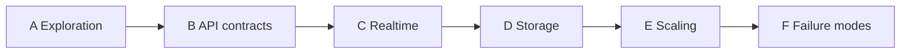

# Formation System-Design Track

North star: **system design interview phases**, not module titles.
Mentor feedback (already in [`../outer-loop.md`](../outer-loop.md)): the last mock stalled in exploration — UI minutiae and waiting for interviewer direction. Lead **Requirements → Core APIs → Architecture → Bottlenecks** from minute one.

Formation Client↔Server / server-to-client mapping is a **secondary** column. Existing labs are **linked, not rewritten**.

**Pre-Wed Kevin warm-up:** Wed Sep 23 4–5pm PDT Formation Design Drills (Advanced Client/Server, Kevin Farst) — sole 20–30 min sheet: [`wed-kevin-warmup.md`](./wed-kevin-warmup.md).

> *"As software engineers, typing IS learning. When we type, we embody the code, the software. If we outsource our typing, we outsource our learning."*

---

## Interview phase map

```text
Phase A  Clarifying / Exploration     NEW  exploration-discipline/     (15–20 min written)
Phase B  API contracts                     rest-api-trading/           (type the HTTP specs)
Phase C  Realtime / client-server          deal-room + lifecycle       (push vs pull, then reconnect)
Phase D  Storage                           queued stub
Phase E  Scaling                           queued stub
Phase F  Failure modes                     queued stub
```

| Phase | Interview job | Lab | Formation module (secondary) | Status |
| :--- | :--- | :--- | :--- | :--- |
| **A** Clarifying / Exploration | Quantify NFRs, state assumptions, own the agenda — **no UI** | [`exploration-discipline/`](./exploration-discipline/) | Warm-up / 4-step framework | 🟢 Ready |
| **B** API contracts | Entities + request/response before boxes | [`../rest-api-trading/`](../rest-api-trading/) (`exercise_trading_api.md`) | Client→server REST | 🟢 Ready (remediation lane) |
| **C** Realtime / client-server | How updates move; what happens when the socket dies | [`../realtime-deal-room/`](../realtime-deal-room/) + [`connection-lifecycle/`](./connection-lifecycle/) | Server-to-client transports + connection lifecycle | 🟢 Ready |
| **D** Storage | What is durable vs a bounded replay buffer | queued stub | Persistent stores | ⏳ Stub |
| **E** Scaling | Fan-out, cache, many connection servers | queued stub | Caching / multi-service | ⏳ Stub |
| **F** Failure modes | Idempotency, retries, partitions, backpressure | queued stub | Deep dives | ⏳ Stub |

Start at **Phase A** every session until you can narrate the 4-step framework cold. Then B (contracts) and C (realtime). D–F stay stubbed.



---

## Phase A — Clarifying / Exploration (new)

**Folder:** [`./exploration-discipline/`](./exploration-discipline/)

### Intuition it builds
The first five minutes decide the interview. You quantify the system (read/write ratio, SLA, retention) and name entities **before** editor chrome. You drive the next phase; you do not ask the interviewer what to do next.

### Interview mapping
Phase A is the remediation for the mentor mock: *technical judgment showed up after prompting; time went to image buttons and draft-save intervals.*

### Formation mapping (secondary)
4-step framework warm-up. Not a Client↔Server transport lab.

### How to run
```bash
# no server — open the markdown and start a 15–20 min timer
# type into [STEP] blocks in order; do not skip to boxes
```

Open [`exploration-discipline/drill.md`](./exploration-discipline/drill.md).

### Done when
- You can narrate Requirements → APIs → Architecture → Bottlenecks **cold**, without notes.
- The drill has numbers and contracts **above** any box diagram.
- The anti-pattern checklist is all unchecked (no UI detour, no “what next?”).

---

## Phase B — API contracts

**Folder:** [`../rest-api-trading/`](../rest-api-trading/) (existing, do not rewrite)

Remediation lane already in progress: type [`exercise_trading_api.md`](../rest-api-trading/exercise_trading_api.md) and [`trading_api_contract.ts`](../rest-api-trading/trading_api_contract.ts).

### Intuition it builds
Request/response contracts. Resource URIs, param placement, retries that must not double-submit a buy, IDOR on order reads.

### Interview mapping
Phase B is “core domain + APIs” — the interviewer should hear method, path, and failure codes **before** Redis or a matching engine.

### Formation mapping (secondary)
Client↔Server request design (not the push path).

### Done when
- All five actions have method, path, param placement, and status codes.
- Place-order is idempotent under retry; list-orders does not trust client-supplied user ids blindly.

---

## Phase C — Realtime / client-server

Two labs, in this order. Do not rewrite either folder.

### C1 — Transports (deal room)

**Folder:** [`../realtime-deal-room/`](../realtime-deal-room/)

Push vs pull. Why polling feels laggy, why SSE is a one-way radio, why WebSockets win for bidirectional high-frequency rooms — and what you pay in connection state.

```bash
cd exercises/realtime-deal-room
npm install
npm run compare
```

**Done when:** you can defend a transport from the printed metrics *and* name a case where SSE + REST is enough.

### C2 — Connection lifecycle

**Folder:** [`./connection-lifecycle/`](./connection-lifecycle/)

Heartbeats, exponential backoff reconnect, monotonic `seq` catch-up — the follow-up after transport choice.

```bash
cd exercises/formation-sd/connection-lifecycle
npm install
npm run sim
```

Work in `starter/`. Compare `reference/` only after a draft.

**Done when:** `npm run sim` prints heartbeat interval, reconnect time, and missed events recovered; your starter fills `seq` gaps without a full snapshot.

### Formation mapping (secondary)
Server-to-client: *how does the server get updates to the client, and what happens when the socket dies?*

---

## Phase D (queued) — Storage

No implementation yet.

- When the in-memory event log is not enough (process restart, multi-instance).
- What belongs in a write-ahead log / DB vs a bounded replay buffer.
- Snapshot + `seq` log after the buffer wraps; blob store for bodies vs relational metadata.

---

## Phase E (queued) — Scaling

No implementation yet.

- Fan-out on write vs read (feeds, presence, last-sale).
- Cache/CDN for read-heavy GETs; who invalidates after publish.
- Many connection servers: pub/sub vs sticky sessions; who owns `seq`.

---

## Phase F (queued) — Failure modes

No implementation yet. The deep-dive phase: pick **one** and go to the metal.

- Idempotency under retries (link back to Phase B place-order).
- Partitions and split-brain on a live room.
- Backpressure / 429 vs dropped ticks vs degraded poll.
- Cache stampedes and replay-buffer wrap.

A 35–40 min mock is just A→F on a clock. Do not wait for a new repo to practice that.

---

## Practice workflow

1. Phase A on a timer until the 4-step is automatic ([`../outer-loop.md`](../outer-loop.md)).
2. Phase B: type the trading contracts; do not paste.
3. Phase C: deal-room `compare`, then lifecycle `starter/` STEPs — `reference/` is the answer key, not the first draft.
4. Pair syntax with [`../inner-loop.md`](../inner-loop.md); keep altitude with the outer-loop agent.
