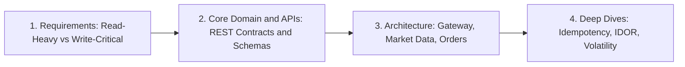

# 📈 REST API Design: Robinhood-Style Stock Trading Platform

> **Original interview answer:** Design safe idempotent trading APIs.

Welcome to the hands-on **Stock Trading REST API Design** exercise.

In this track, you will design the public and client-facing HTTP contracts for a high-throughput retail trading application (like Robinhood). You will convert high-level domain actions into production-ready, RESTful interfaces that satisfy enterprise constraints: precision financial types, cacheability, idempotency, security against IDOR, and strict HTTP semantics.

This is the one track that stays intentionally **fintech-specific**, so the business domain is not just translation — it is part of the actual exercise.

> *"As software engineers, typing IS learning. When we type, we are embodying the code, the software. If we outsource our typing, we outsource our learning."*

---

## 🎯 The Challenge & Domain Actions

You are tasked with translating 5 core trading platform actions into clean REST APIs:

1. **`viewStockQuote(symbol)`** $\to$ Fetch the real-time quote and ticker data for a single stock.
2. **`viewStockQuotes(List<symbol>)`** $\to$ Fetch real-time quotes for a batch of stocks (e.g. watchlist, portfolio overview).
3. **`placeOrder(symbol, quantity, orderType)`** $\to$ Place an order to buy or sell a given quantity and order type.
4. **`viewOrder(orderId)`** $\to$ Fetch the details and fill status of a specific order.
5. **`viewAllOrders(userId)`** $\to$ Fetch the order history for a given user.

For each action, your API specification must establish:
- **HTTP Method**: `GET`, `POST`, `PUT`, `PATCH`, or `DELETE`.
- **Path**: Clean RESTful URI structure (nouns, pluralization, resource hierarchies).
- **Input Parameter Placement**: Path params, Query params, Headers, or Request Body.
- **Payload & Response Schemas**: Accurate types, precise monetary representations, and status codes (`200 OK`, `201 Created` with `Location`, `400`, `401`, `403`, `404`, `422`, `409`).

---

## 🧭 Senior System Design Framework Grounding

Before jumping into endpoints, frame the problem using the 4-step framework:



```text
[1. Requirements] ──> [2. Core Domain & APIs] ──> [3. Architecture] ──> [4. Deep Dives]
 (Read vs Write)       (REST Schemas & DTOs)     (Gateway & Orders)    (Idempotency & IDOR)
```

### 1. Requirements & Traffic Disparity
- **Market Data (Quotes)**: Massive read volume (100:1 or 1,000:1 read-to-write ratio). Volatile, sub-second latency sensitivity, highly cacheable at edge/CDN or short TTL Redis clusters.
- **Order Execution (Orders)**: Mission-critical writes. Low tolerance for data loss. Must be **transactional**, **strictly validated**, and **idempotent** (network retries must never double-execute a \$10,000 market buy).

### 2. Core REST Rules of Engagement
| Concept | Where It Belongs | Anti-Pattern to Avoid |
| :--- | :--- | :--- |
| **Resource Identity** | Path Parameter (`/orders/{orderId}`, `/stocks/{symbol}/quote`) | Putting identity in the query string (`/order?id=123`) or request body for a GET. |
| **Filters, Sorting, Batching** | Query Parameter (`/quotes?symbols=AAPL,MSFT`, `/orders?status=FILLED&limit=50`) | Using `POST /batch-quotes` just because inputs are a list, or baking filters into paths (`/orders/filled`). |
| **Resource Creation / Mutation** | Request Body (`POST /orders`) | Passing order parameters in the query string (`POST /orders?symbol=AAPL&qty=10`). |
| **Safe & Idempotent Reads** | `GET` (never alters server state, cacheable) | Using `GET` to mutate state or trigger background execution. |
| **Financial Integrity** | String decimals (e.g. `"185.25"`) or integer cents | IEEE-754 `float` / `double` which introduces catastrophic floating-point rounding errors. |
| **Identity & Security** | Header (`Authorization: Bearer <token>`) & `/orders` or `/users/me/orders` | Blindly accepting `GET /users/{userId}/orders` from mobile clients, risking **IDOR** (Insecure Direct Object Reference). |

---

## 🛠️ How to Practice (Typing IS Learning)

This track provides two complementary files to cement your understanding:

1. **[`exercise_trading_api.md`](./exercise_trading_api.md)**:  
   The interactive drill markdown file. Work through Steps 1 through 6, typing out the full API specification, status codes, sample request/response JSONs, and architectural justifications.
2. **[`trading_api_contract.ts`](./trading_api_contract.ts)**:  
   A strongly-typed TypeScript contract file. Fill out the request/response interfaces, query schemas, and route definition types.

---

## 🤖 Two-Agent Support

- **`[Inner-Loop Agent]`**: Pairs with you pre-push to unblock syntax, JSON formatting, TypeScript interfaces, and HTTP header specifics. Never writes the answers for you — gives inline hints so you type the solution.
- **`[Outer-Loop Agent]`**: Intervenes if you drop into frontend UI minutiae; keeps you focused on distributed trade-offs (matching engine boundaries, idempotency stores, distributed locking, polling vs WebSockets).
